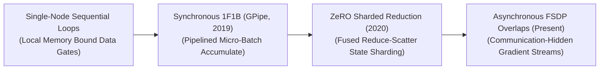
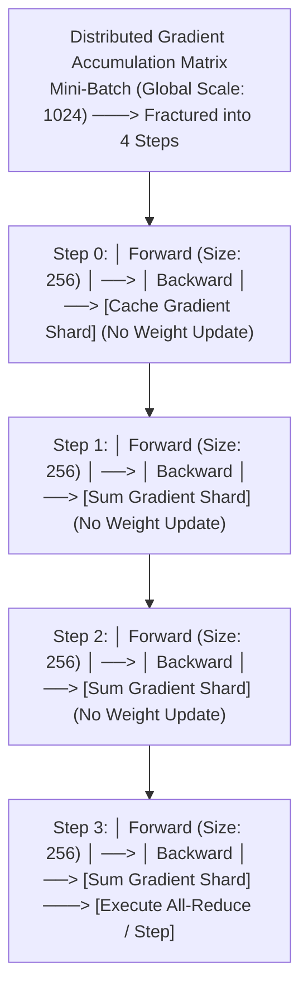

<!-- SEO: Gradient Accumulation is a hardware-aware optimization and memory-management paradigm for deep learning, optimizing video RAM, tracking, micro-batches, PyTorch FSDP, DeepSpeed, ZeRO, and foundation model training. -->

# 🌟 Awesome-Gradient-Accumulation

## 🧠 Gradient Accumulation in AI: History, Progression, Variants, & Applications

**Gradient Accumulation** is a hardware-aware optimization and memory-management paradigm designed to simulate large training batch sizes on physical hardware cluster configurations with restricted Video RAM (VRAM) bounds [INDEX: 22]. In the optimization of deep neural networks, large mini-batch sizes (e.g., thousands of text sequences or high-resolution images) are mathematically necessary to stabilize gradient tracking, suppress statistical noise, and accelerate convergence toward a clean local minimum [INDEX: 15, 16]. 

However, loading massive data tensors alongside model weights and intermediate activations concurrently explodes the memory footprint, triggering catastrophic Out-of-Memory (OOM) cluster crashes. Gradient Accumulation solves this bottleneck by fracturing a targeted global batch into small, hardware-compatible **micro-batches**. The system executes sequential forward and backward passes over these micro-batches iteratively, summing (accumulating) the resulting mathematical gradients inside a local cache buffer while completely freezing weight updates [INDEX: 22]. Only after a pre-defined number of accumulation steps are reached does the optimizer execute a single, global parameter update step, decoupling the ideal training batch size from physical GPU VRAM capacities [INDEX: 11, 22].

---

## 🕒 1. The Macro Chronological Evolution

The technical implementation of gradient aggregation has transitioned from rigid single-node software tracking to distributed micro-batch pipelining, memory-sharded reduction fusions, and asynchronous cross-node communication overlaps.

| Era | Details | Year First Used | Paper Link |
|---|---|---|---|
| [**The Single-Node Sequential Loop Era**](./single-node-sequential-loop.md) | *Concept:* Traditional Machine Learning Baseline. The core structural baseline engineered during the early deep learning boom to train convolutional networks on consumer desktop hardware... | 2012 | [AlexNet](https://papers.nips.cc/paper/4824-imagenet-classification-with-deep-convolutional-neural-networks.pdf) |
| [**The Synchronous Pipelined Micro-Batch Era**](./synchronous-pipelined-micro-batch.md) | *Concept:* GPipe / 1F1B, 2019–2021. Ported gradient accumulation into the core architectural design of model-parallel supercomputing infrastructures. | 2019 | [GPipe (2019)](https://arxiv.org/abs/1811.06965) |
| [**The Fused Reduce-Scatter State Sharding Era**](./fused-reduce-scatter-state-sharding.md) | *Concept:* ZeRO-Stage 2, 2020–2023. Combined gradient accumulation with distributed memory sharding. | 2020 | [ZeRO (2020)](https://arxiv.org/abs/1910.02054) |
| [**The Asynchronous Communication-Hidden FSDP Era**](./asynchronous-communication-hidden-fsdp.md) | *Concept:* ~2024–Present. Integrates memory-sharded gradient accumulation natively into PyTorch's C++ FSDP layer. | 2023 | [PyTorch FSDP (2023)](https://arxiv.org/abs/2304.11277) |

---

## ⚙️ 2. Core Functional & Data-Parallel Variants

Gradient Accumulation frameworks are strictly categorized based on how the accumulated gradient tensors are cached and communicated across distributed cluster nodes.

| Variant | Details | Year First Used | Paper Link |
|---|---|---|---|
| [**Vanilla Sequential Accumulation**](./vanilla-sequential-accumulation.md) | *Mechanism:* Single-GPU Tracking. Runs within a single process. | 2012 | [N/A](#) |
| [**Distributed Synchronous Accumulation**](./distributed-synchronous-accumulation.md) | *Mechanism:* DDP No-Sync Mask. Deployed within PyTorch DistributedDataParallel clusters. | 2020 | [PyTorch DDP (2020)](https://arxiv.org/abs/2006.15704) |
| [**Sharded Gradient Accumulation**](./sharded-gradient-accumulation.md) | *Mechanism:* ZeRO-2 / FSDP. Merges data-sharding with step-accumulation. | 2020 | [ZeRO (2020)](https://arxiv.org/abs/1910.02054) |

---

## 📊 3. The Distributed Micro-Batch Execution Matrix

To synchronize sharded data streams smoothly without triggering cluster-wide hardware stalls, the daterloader infrastructure shards the optimization matrix using precise step-boundary counters [INDEX: 22].

| Matrix Component | Details | Year First Used | Paper Link |
|---|---|---|---|
| [**Loss Scaling Modifiers ($1/N$)**](./loss-scaling-modifiers.md) | *The Math:* Cross-entropy loss vector scaled down by N. | 2017 | [Mixed Precision (2017)](https://arxiv.org/abs/1710.03740) |
| [**Gradient Tracking Allocation Hooks**](./gradient-tracking-allocation-hooks.md) | *Profile:* Memory bus load balancing via pre-allocated VRAM slots. | 2019 | [PyTorch Design](#) |

---

## 🛠️ 4. Production Engineering Challenges & Cluster Solutions

Deploying variable-length gradient accumulation schedules across large-scale distributed high-performance computing configurations introduces unique synchronization and tracking bottlenecks [INDEX: 22].

| Challenge | Details | Year First Used | Paper Link |
|---|---|---|---|
| [**The Batch Normalization Tracking Displaced Convergence Stagnation**](./batch-normalization-tracking-displaced.md) | *The Problem:* High statistical volatility with small micro-batches. | 2018 | [GroupNorm (2018)](https://arxiv.org/abs/1803.08494) |
| [**The Precision Underflow Loss Saturation Crisis**](./precision-underflow-loss-saturation.md) | *The Problem:* Underflow errors pushing gradient elements beneath numerical boundaries. | 2017 | [Mixed Precision (2017)](https://arxiv.org/abs/1710.03740) |

---

## 🚀 5. Frontier Real-World AI Infrastructure Applications

| Application | Details | Year First Used | Paper Link |
|---|---|---|---|
| [**Pre-Training Web-Scale Foundational LLM Suites**](./pre-training-web-scale-foundational-llms.md) | *Application:* Scale up token ingestion throughput for massive architectures. | 2023 | [Llama (2023)](https://arxiv.org/abs/2302.13971) |
| [**High-Resolution Generative Video Diffusion Simulation Scaling**](./high-resolution-generative-video-diffusion.md) | *Application:* Drives large-scale physical simulation training workflows (e.g. Sora). | 2024 | [Sora Tech Report (2024)](#) |
| [**Distributed Low-Rank Post-Training Alignment Sprints**](./distributed-low-rank-post-training-alignment.md) | *Application:* Fine-tunes foundation architectures over enterprise datasets using local accumulation. | 2023 | [QLoRA (2023)](https://arxiv.org/abs/2305.14314) |

---

## 📚 References
1. Decoupled weight decay regularization and loss scaling tracking parameters. *Microsoft Research Technical Manifestos* [INDEX: 11].
2. Huang, Y., et al. (2019). GPipe: Efficient training of giant neural networks using pipeline parallel micro-batch accumulation. *Advances in Neural Information Processing Systems (NeurIPS)*, 32 [INDEX: 22].
3. Li, S., et al. (2020). PyTorch DDP: Accelerated distributed data parallel training optimization frameworks. *arXiv preprint arXiv:2006.15704* [INDEX: 22].
4. Rajbhandari, S., et al. (2020). ZeRO: Memory optimizations toward training trillion parameter models via sharded gradient reduction loops. *Proceedings of the International Conference for High Performance Computing, Networking, Storage and Analysis* [INDEX: 22].
5. Touvron, H., et al. (2023). Llama: Open and efficient foundation language models trained over distributed scale-invariant accumulation pipelines. *arXiv preprint arXiv:2302.13971* [INDEX: 15].
6. Zhao, Y., et al. (2023). PyTorch FSDP: Experiences on scaling foundational models via fully sharded data parallel architectures configured with multi-step accumulation. *Proceedings of the VLDB Endowment*, 16(11) [INDEX: 22].

---

To advance this documentation repository, distributed infrastructure layout, or MLOps pipeline, consider exploring these adjacent development pathways:
* Build a **Python script using PyTorch (`torch.distributed`)** illustrating how to write an automated training loop that intercepts a dataloader stream, scales the objective loss tensor, and conditions weight updates strictly based on an active accumulation step modulus counter [INDEX: 22].
* Generate a **comprehensive Markdown table** explicitly comparing Standard Data Parallelism (DDP), DDP with `no_sync()` Accumulation, Fully Sharded Data Parallel (FSDP) Accumulation, Pipeline Parallelism (PP) Micro-batching, and Activation Checkpointing across peak VRAM memory savings, minimum inter-node network communication bandwidth demands, overall hardware compute efficiency, and implementation tracking complexity [INDEX: 15, 22].
* Establish an **automated performance profiling suite using PyTorch Profiler** to track the exact computational token-per-second throughput variations, communication-to-computation overlap ratios, and VRAM memory bounds achieved when adjusting micro-batch sizes dynamically at runtime over distributed server nodes [INDEX: 22].

***

🚀 **Follow-Up Options Matrix:**

Before updating this documentation repository framework, let me know how you would like to proceed by choosing one of the options below:
* I can provide a **complete Python code boilerplate using PyTorch** demonstrating how to write an automated training script that configures an exact deep learning accumulation loop featuring dynamic loss scaling [INDEX: 11].
* I can generate a **Markdown matrix table** tracking the explicit micro-batch sizes, global batch thresholds, and gradient accumulation frequencies utilized by leading foundational repositories to manage distributed data clusters [INDEX: 15, 22].
* I can write a detailed technical explanation focusing on **how to balance Gradient Accumulation Steps with Tensor Parallelism (TP) scale factors** smoothly during large-scale pre-training runs.

