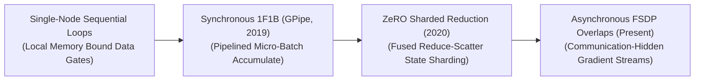
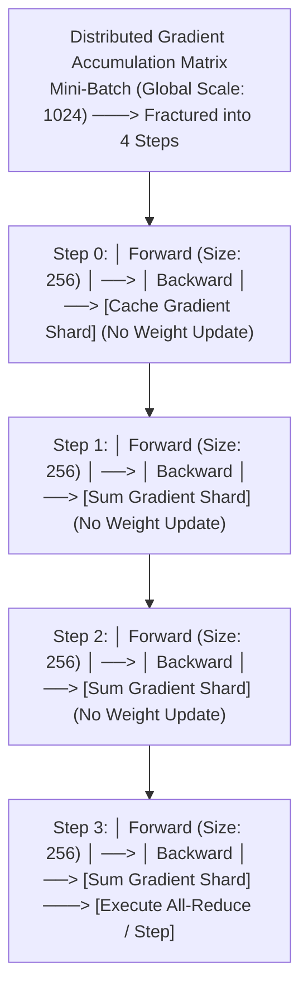

# Awesome-Gradient-Accumulation
## Gradient Accumulation in AI: History, Progression, Variants, & Applications

**Gradient Accumulation** is a hardware-aware optimization and memory-management paradigm designed to simulate large training batch sizes on physical hardware cluster configurations with restricted Video RAM (VRAM) bounds [INDEX: 22]. In the optimization of deep neural networks, large mini-batch sizes (e.g., thousands of text sequences or high-resolution images) are mathematically necessary to stabilize gradient tracking, suppress statistical noise, and accelerate convergence toward a clean local minimum [INDEX: 15, 16]. 

However, loading massive data tensors alongside model weights and intermediate activations concurrently explodes the memory footprint, triggering catastrophic Out-of-Memory (OOM) cluster crashes. Gradient Accumulation solves this bottleneck by fracturing a targeted global batch into small, hardware-compatible **micro-batches**. The system executes sequential forward and backward passes over these micro-batches iteratively, summing (accumulating) the resulting mathematical gradients inside a local cache buffer while completely freezing weight updates [INDEX: 22]. Only after a pre-defined number of accumulation steps are reached does the optimizer execute a single, global parameter update step, decoupling the ideal training batch size from physical GPU VRAM capacities [INDEX: 11, 22].

---

## 1. The Macro Chronological Evolution

The technical implementation of gradient aggregation has transitioned from rigid single-node software tracking to distributed micro-batch pipelining, memory-sharded reduction fusions, and asynchronous cross-node communication overlaps.

*   **The Single-Node Sequential Loop Era (Traditional Machine Learning Baseline)**
    *   *Concept:* The core structural baseline engineered during the early deep learning boom to train convolutional networks on consumer desktop hardware. Dataloaders sliced a batch into sequential iterations. The framework calculated local gradients over a micro-batch, appended them to a static memory tensor using an addition operator (`loss.backward()`), and ran the optimizer step (`optimizer.step()`) followed by a hard memory flush (`optimizer.zero_grad()`) only at fixed interval markers.
    *   *Limitation:* Confined to standalone local processes, failing completely when scaled to massive distributed cluster networks where thousands of nodes must synchronize gradients concurrently over slow interconnect wires.
*   **The Synchronous Pipelined Micro-Batch Era (GPipe / 1F1B, 2019–2021)**
    *   *Concept:* Ported gradient accumulation into the core architectural design of model-parallel supercomputing infrastructures [INDEX: 22]. Popularized by Google's GPipe and NVIDIA's Megatron-LM, **Pipeline Parallelism (PP)** cuts massive model layer blocks sequentially across distinct hardware cards. To prevent GPUs from sitting completely idle while waiting for sequential node-to-node passes to finish (the pipeline bubble), the global batch is split into $M$ **accumulation micro-batches**. 
    *   *Significance:* Under the **1F1B (One Forward, One Backward)** schedule, each card accumulates gradients across successive micro-batch intervals stably, executing a synchronized global weight update only after the entire pipeline grid drains completely.
*   **The Fused Reduce-Scatter State Sharding Era (ZeRO-Stage 2, 2020–2023)**
    *   *Concept:* Combined gradient accumulation with distributed memory sharding [INDEX: 22]. Popularized by Microsoft's DeepSpeed library, the **ZeRO (Zero Redundancy Optimizer)** framework proved that model states could be sharded across data-parallel processes without changing the underlying optimization math [INDEX: 22]. ZeRO-2 refactored accumulation: instead of caching uncompressed global gradients on every individual GPU, nodes execute a **Reduce-Scatter primitive** on-the-fly during the backward pass [INDEX: 22].
    *   *Significance:* Each GPU accumulates gradients strictly for its own allocated optimizer slice, reducing the memory footprint by up to $4\times$ while the accumulation loop unrolls.
*   **The Asynchronous Communication-Hidden FSDP Era (~2024–Present)**
    *   *Concept:* The current modern state-of-the-art foundation standard. It integrates memory-sharded gradient accumulation natively into PyTorch's C++ **Fully Sharded Data Parallel (FSDP)** layer [INDEX: 22].
    *   *Significance:* It achieves absolute **Communication-Computation Overlapping** [INDEX: 22]. As layer $L$ calculates its backward gradient derivatives for micro-batch $i$, FSDP automatically initiates an asynchronous, non-blocking gradient communication stream over the network switches for micro-batch $i-1$ in the background. This hides interconnect transit latencies completely, keeping GPU Tensor Cores continuously saturated at peak compute velocity.

---

## 2. Core Functional & Data-Parallel Variants

Gradient Accumulation frameworks are strictly categorized based on how the accumulated gradient tensors are cached and communicated across distributed cluster nodes.

- ### A. Vanilla Sequential Accumulation (Single-GPU Tracking)
	*   **Mechanism:** Runs within a single process. It scales the loss value by the inverse of the accumulation steps ($1/N$) to maintain invariant mathematical gradients, recursively calling the backward pass to build up the gradient tensor before the optimizer fires.
	*   **Pros:** Requires zero secondary network orchestration, making it a highly reliable engine for local edge model fine-tuning loops [INDEX: 16].

- ### B. Distributed Synchronous Accumulation (DDP No-Sync Mask)
	*   **Mechanism:** Deployed within PyTorch **DistributedDataParallel (DDP)** clusters [INDEX: 22]. Naive DDP triggers a costly cross-node communication broadcast (`All-Reduce`) at the end of *every single backward pass* to sync gradients [INDEX: 22]. DDP Accumulation uses the `no_sync()` context manager enclave, hard-locking local cards to accumulate gradients invisibly in their local cache buffers, launching a single global `All-Reduce` synchronization step only on the final boundary iteration [INDEX: 22].

- ### C. Sharded Gradient Accumulation (ZeRO-2 / FSDP)
	*   **Mechanism:** Merges data-sharding with step-accumulation [INDEX: 22]. Individual cards are physically blocked from storing full-model gradient copies [INDEX: 22]. The accumulation loop populates fractioned gradient shards across distributed cards on-the-fly, maximizing VRAM optimization efficiency [INDEX: 22].

---

## 3. The Distributed Micro-Batch Execution Matrix

To synchronize sharded data streams smoothly without triggering cluster-wide hardware stalls, the daterloader infrastructure shards the optimization matrix using precise step-boundary counters [INDEX: 22].

*   **Loss Scaling Modifiers ($1/N$)**
    *   *The Math:* Because the global optimization step is calculated over $N$ independent accumulation sub-steps, the cross-entropy loss vector calculated at each micro-batch forward pass must be explicitly scaled down by dividing it by $N$ ($\mathcal{L}_{\text{scaled}} = \mathcal{L} / N$). This ensures the cumulative gradient step magnitude matches the exact mathematical scale of processing the global batch all at once, preventing learning rate tracking drift.
*   **Gradient Tracking Allocation Hooks**
    *   *Profile:* Memory bus load balancing. In standard foundational training sweeps, the accumulated global gradient tensor memory slots are permanently pre-allocated inside GPU VRAM at initialization step zero, avoiding continuous memory allocation and de-allocation cycles that fragment VRAM registers.

---

## 4. Production Engineering Challenges & Cluster Solutions

Deploying variable-length gradient accumulation schedules across large-scale distributed high-performance computing configurations introduces unique synchronization and tracking bottlenecks [INDEX: 22].

*   **The Batch Normalization Tracking Displaced Convergence Stagnation**
    *   *The Problem:* Traditional deep convolutional networks utilize **Batch Normalization (BatchNorm)** layers, which calculate running mean and variance statistics over the active batch at each forward step. When executing gradient accumulation, BatchNorm only calculates statistics over the tiny micro-batch layer (e.g., size 4), resulting in high statistical volatility that destabilizes global convergence and degrades model capabilities.
    *   *Mitigation:* Fully migrating modern foundation training infrastructures to **Layer Normalization (LayerNorm)**, Group Normalization, or RMSNorm topologies, which calculate normalization statistics entirely within individual token vectors independently, completely bypassing batch-size tracking dependencies.
*   **The Precision Underflow Loss Saturation Crisis**
    *   *The Problem:* When scaling gradient accumulation to multi-billion parameter foundation architectures using low-precision 16-bit floats (FP16 or BF16) [INDEX: 11, 15], scaling down micro-batch losses by a massive accumulation factor ($1/N$) can push long-tail gradient elements beneath numerical boundaries. This triggers **Underflow Errors**, zeroing out learning increments and causing loss optimization to plateau.
    *   *Mitigation:* Deploying **Dynamic Loss Scaling (Mixed-Precision Optimization)** [INDEX: 11], multiplying the active loss tensor by a large factor (e.g., $2^{16}$) prior to backpropagation to inflate gradient values into safe precision windows, executing the accumulation addition steps before un-scaling and updating 32-bit master weights [INDEX: 11].

---

## 5. Frontier Real-World AI Infrastructure Applications

*   **Pre-Training Web-Scale Foundational LLM Suites (DeepSpeed/FSDP Clusters)**
    *   *Application:* Serves as the primary supercomputing orchestration framework used to scale up token ingestion throughput [INDEX: 15, 22]. Foundation clusters layer Gradient Accumulation alongside Tensor Parallelism and Pipeline Parallelism to simulate colossal global batch sizes (e.g., 4 million to 8 million tokens per step) over thousands of GPUs cleanly without encountering VRAM exhaustion [INDEX: 15, 22].
*   **High-Resolution Generative Video Diffusion Simulation Scaling (Sora Class)**
    *   *Application:* Drives large-scale physical simulation training workflows. Massive 3D spatio-temporal video token cubes generate enormous activation footprints; micro-batch gradient accumulation allows flow-matching ordinary differential equation (ODE) vector fields to optimize over multi-megapixel video sequences concurrently on standard hardware layouts.
*   **Distributed Low-Rank Post-Training Alignment Sprints (LoRA / QLoRA Tuning)**
    *   *Application:* Fine-tunes foundation architectures over domain-specific enterprise datasets (such as private corporate legal or healthcare portfolios) [INDEX: 11, 16]. Distributed FSDP configurations shard low-rank adapter gradients and utilize local accumulation steps (e.g., setting micro-batch size 2 with accumulation step 32) to simulate large, stable optimization batch boundaries on commodity edge server nodes smoothly [INDEX: 16, 22].

---

## References
1. Decoupled weight decay regularization and loss scaling tracking parameters. *Microsoft Research Technical Manifestos* [INDEX: 11].
2. Huang, Y., et al. (2019). GPipe: Efficient training of giant neural networks using pipeline parallel micro-batch accumulation. *Advances in Neural Information Processing Systems (NeurIPS)*, 32 [INDEX: 22].
3. Li, S., et al. (2020). PyTorch DDP: Accelerated distributed data parallel training optimization frameworks. *arXiv preprint arXiv:2006.15704* [INDEX: 22].
4. Rajbhandari, S., et al. (2020). ZeRO: Memory optimizations toward training trillion parameter models via sharded gradient reduction loops. *Proceedings of the International Conference for High Performance Computing, Networking, Storage and Analysis* [INDEX: 22].
5. Touvron, H., et al. (2023). Llama: Open and efficient foundation language models trained over distributed scale-invariant accumulation pipelines. *arXiv preprint arXiv:2302.13971* [INDEX: 15].
6. Zhao, Y., et al. (2023). PyTorch FSDP: Experiences on scaling foundational models via fully sharded data parallel architectures configured with multi-step accumulation. *Proceedings of the VLDB Endowment*, 16(11) [INDEX: 22].

---

To advance this documentation repository, distributed infrastructure layout, or MLOps pipeline, consider exploring these adjacent development pathways:
* Build a **Python script using PyTorch (`torch.distributed`)** illustrating how to write an automated training loop that intercepts a dataloader stream, scales the objective loss tensor, and conditions weight updates strictly based on an active accumulation step modulus counter [INDEX: 22].
* Generate a **comprehensive Markdown table** explicitly comparing Standard Data Parallelism (DDP), DDP with `no_sync()` Accumulation, Fully Sharded Data Parallel (FSDP) Accumulation, Pipeline Parallelism (PP) Micro-batching, and Activation Checkpointing across peak VRAM memory savings, minimum inter-node network communication bandwidth demands, overall hardware compute efficiency, and implementation tracking complexity [INDEX: 15, 22].
* Establish an **automated performance profiling suite using PyTorch Profiler** to track the exact computational token-per-second throughput variations, communication-to-computation overlap ratios, and VRAM memory bounds achieved when adjusting micro-batch sizes dynamically at runtime over distributed server nodes [INDEX: 22].

***

**Follow-Up Options Matrix:**

Before updating this documentation repository framework, let me know how you would like to proceed by choosing one of the options below:
* I can provide a **complete Python code boilerplate using PyTorch** demonstrating how to write an automated training script that configures an exact deep learning accumulation loop featuring dynamic loss scaling [INDEX: 11].
* I can generate a **Markdown matrix table** tracking the explicit micro-batch sizes, global batch thresholds, and gradient accumulation frequencies utilized by leading foundational repositories to manage distributed data clusters [INDEX: 15, 22].
* I can write a detailed technical explanation focusing on **how to balance Gradient Accumulation Steps with Tensor Parallelism (TP) scale factors** smoothly during large-scale pre-training runs.

