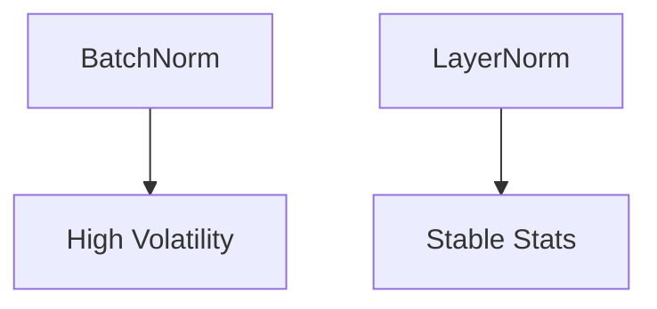

# The Batch Normalization Tracking Displaced Convergence Stagnation

## Description
The Problem: High statistical volatility.

## Year First Used
2018

## Paper Link
[GroupNorm (2018)](https://arxiv.org/abs/1803.08494)

## Diagram

[Back to Main Repository](./README.md)
