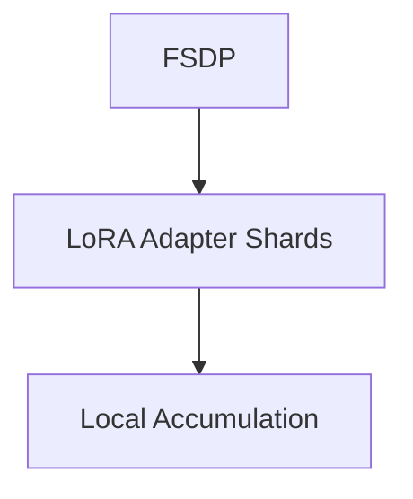

# Distributed Low-Rank Post-Training Alignment Sprints

## Description
Application: Fine-tunes foundation architectures.

## Year First Used
2023

## Paper Link
[QLoRA (2023)](https://arxiv.org/abs/2305.14314)

## Diagram

[Back to Main Repository](./README.md)
