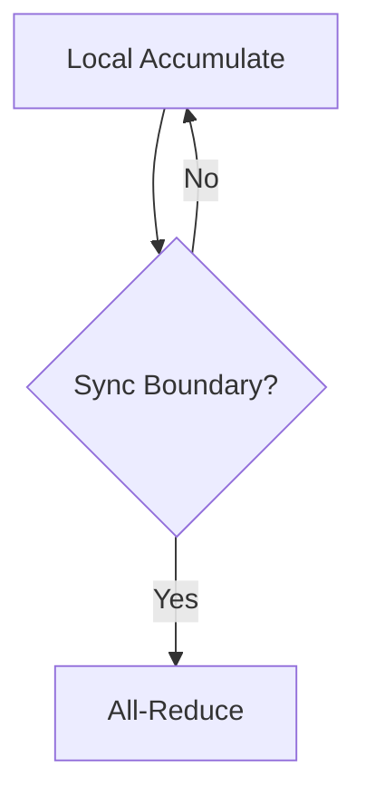

# Distributed Synchronous Accumulation

## Description
DDP No-Sync Mask.

## Year First Used
2020

## Paper Link
[PyTorch DDP (2020)](https://arxiv.org/abs/2006.15704)

## Diagram

[Back to Main Repository](./README.md)
