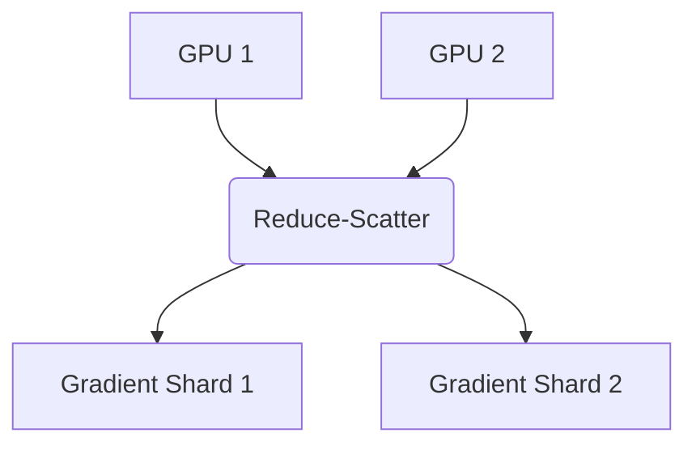

# The Fused Reduce-Scatter State Sharding Era

## Description
ZeRO-Stage 2, 2020–2023.

## Year First Used
2020

## Paper Link
[ZeRO (2020)](https://arxiv.org/abs/1910.02054)

## Diagram

[Back to Main Repository](./README.md)
