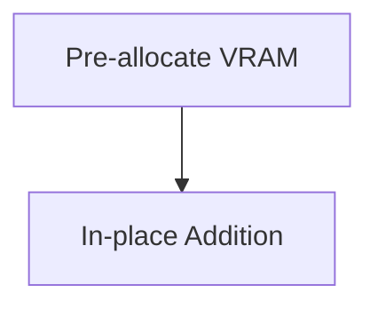

# Gradient Tracking Allocation Hooks

## Description
Profile: Memory bus load balancing.

## Year First Used
2019

## Paper Link
[PyTorch Design](#)

## Diagram

[Back to Main Repository](./README.md)
