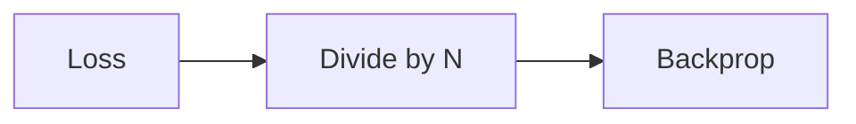

# Loss Scaling Modifiers ($1/N$)

## Description
The Math: Cross-entropy loss vector scaled down.

## Year First Used
2017

## Paper Link
[Mixed Precision (2017)](https://arxiv.org/abs/1710.03740)

## Diagram

[Back to Main Repository](./README.md)
