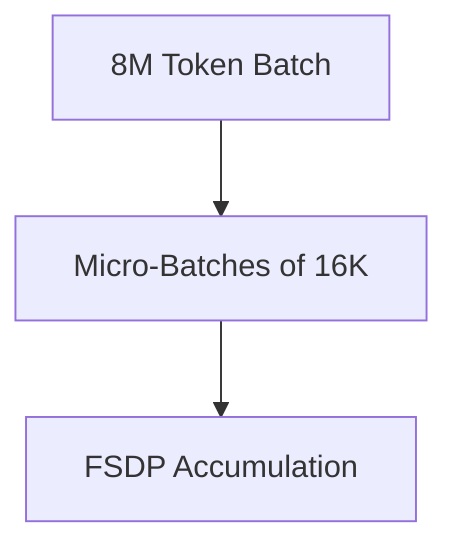

# Pre-Training Web-Scale Foundational LLM Suites

## Description
Application: Scale up token ingestion throughput.

## Year First Used
2023

## Paper Link
[Llama (2023)](https://arxiv.org/abs/2302.13971)

## Diagram

[Back to Main Repository](./README.md)
