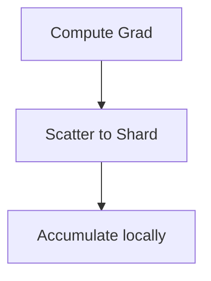

# Sharded Gradient Accumulation

## Description
ZeRO-2 / FSDP.

## Year First Used
2020

## Paper Link
[ZeRO (2020)](https://arxiv.org/abs/1910.02054)

## Diagram

[Back to Main Repository](./README.md)
