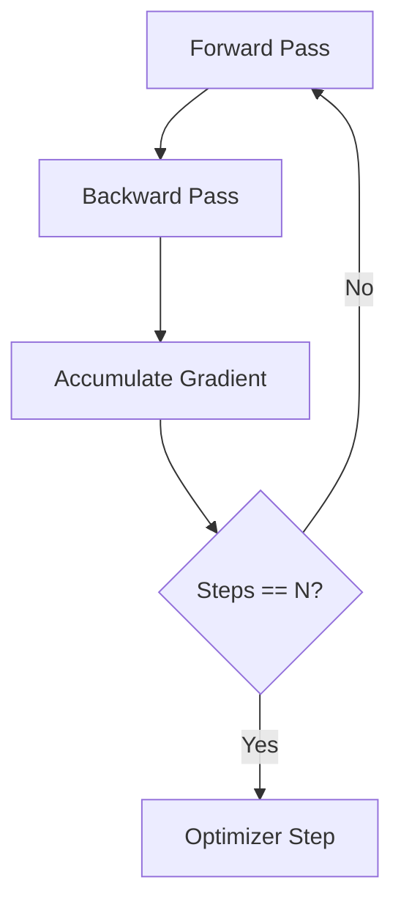

# The Single-Node Sequential Loop Era

## Description
Traditional Machine Learning Baseline.

## Year First Used
2012

## Paper Link
[AlexNet](https://papers.nips.cc/paper/4824-imagenet-classification-with-deep-convolutional-neural-networks.pdf)

## Diagram

[Back to Main Repository](./README.md)
