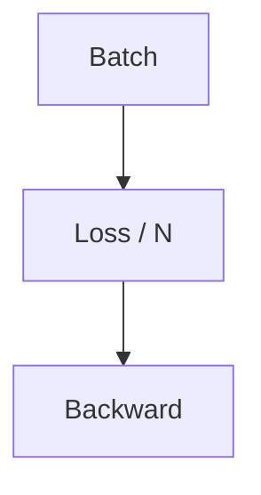

# Vanilla Sequential Accumulation

## Description
Single-GPU Tracking.

## Year First Used
2012

## Paper Link
[N/A](#)

## Diagram

```mermaid
flowchart TD
    A[Batch] --> B[Loss / N] --> C[Backward]
```

[Back to Main Repository](./README.md)
